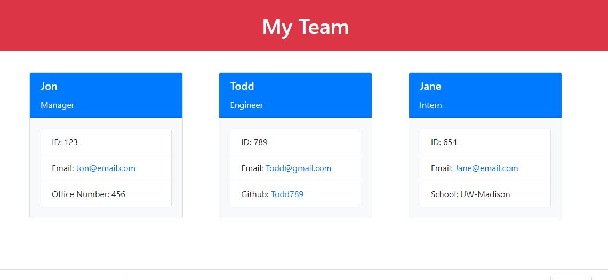

# team-profile-generator

## Purpose

Build a Node.js command-line application that takes in information about employees on a software engineering team and generates an HTML webpage that displays summaries for each person.

## User Story

AS A manager  
I WANT to generate a webpage that displays my team's basic info 
SO THAT I have quick access to their emails and GitHub profiles

## Installation

Clone the repository, then download node: https://nodejs.org/en/download/. Navigate to the the root directory and run 'node index.js' in your terminal.

## Usage

The link below is a tutorial on how to run the program and how to answer the prompts.

[Video Link](https://drive.google.com/file/d/1gW_vLV2q2LVyd-PG4i-q4FKAn3B84686/view)
